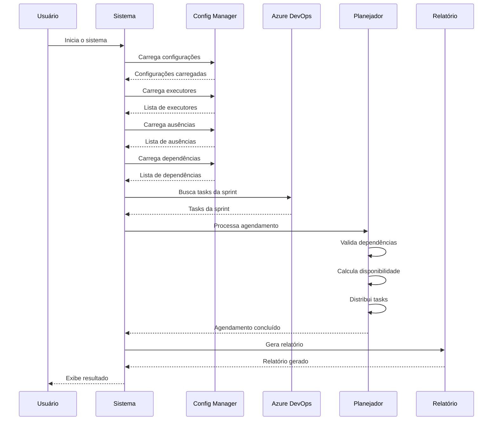

# Sprint Task Scheduler

[](https://www.python.org/downloads/)
[](https://learn.microsoft.com/en-us/rest/api/azure/devops)
[](https://docs.pydantic.dev/)
[](https://github.com/Delgan/loguru)
[](https://github.com/dateutil/dateutil)
[](https://typer.tiangolo.com/)

Um sistema inteligente de agendamento de tarefas para sprints que considera múltiplas frentes de trabalho, ausências e dependências entre tarefas.

## 📋 Índice

- [Visão Geral](#-visão-geral)
- [Funcionalidades](#-funcionalidades)
- [Requisitos](#-requisitos)
- [Instalação](#-instalação)
- [Configuração](#️-configuração)
- [Configuração do Board](#-configuração-do-board)
- [Uso](#-uso)
- [Regras de Negócio](#-regras-de-negócio)
- [Estrutura do Projeto](#-estrutura-do-projeto)
- [Contribuição](#-contribuição)
- [📊 Diagrama de Sequência](#-diagrama-de-sequência)

## 🎯 Visão Geral

O Sprint Task Scheduler é uma ferramenta desenvolvida para otimizar o agendamento de tarefas em sprints de desenvolvimento de software. Ele considera múltiplas frentes de trabalho (Backend, Frontend, QA, DevOps), ausências de colaboradores, dependências entre tarefas e períodos de trabalho específicos para criar um cronograma eficiente e realista.

## ✨ Funcionalidades

- **Agendamento Inteligente**: Distribui tarefas considerando a disponibilidade dos executores
- **Múltiplas Frentes**: Suporte para Backend, Frontend, QA e DevOps
- **Gestão de Ausências**: Considera ausências parciais (manhã/tarde) e totais
- **Dependências**: Respeita dependências entre tarefas
- **Períodos de Trabalho**: Considera horários específicos (9h-12h e 14h-17h)
- **Integração Azure DevOps**: Compatível com datas do Azure DevOps
- **Story Points**: Cálculo automático baseado em horas estimadas

## 📋 Requisitos

- Python 3.8 ou superior
- pip (gerenciador de pacotes Python)
- Acesso ao Azure DevOps (opcional, para integração)

## 🚀 Instalação

1. Clone o repositório:
```bash
git clone https://github.com/seu-usuario/sprint-task-scheduler.git
cd sprint-task-scheduler
```

2. Crie um ambiente virtual (recomendado):
```bash
# Windows
   python -m venv venv
   .\venv\Scripts\activate
   
# Linux/macOS
   python3 -m venv venv
   source venv/bin/activate
```

3. Instale as dependências:
```bash
   pip install -r requirements.txt
```

## ⚙️ Configuração

1. Configure o arquivo principal (`config/setup.json`):
```json
{
    "azure_devops": {
        "organization": "sua-organizacao",
        "project": "seu-projeto",
        "token": "seu-token"
    },
    "sprint": {
        "name": "2024_S13_Mar18-Mar29",
        "year": "2024",
        "quarter": "Q1",
        "start_date": "2024-03-18",
        "end_date": "2024-03-29"
    },
    "team": "Caminho/Da/Sua/Equipe",
    "executors_file": "config/executors.json",
    "dayoffs_file": "config/dayoffs.json",
    "dependencies_file": "config/dependencies.json",
    "output_dir": "./output",
    "timezone": "America/Sao_Paulo"
}
```

2. Configure os executores (`config/executors.json`):
```json
{
    "backend": [
        "backend.dev1@empresa.com",
        "backend.dev2@empresa.com"
    ],
    "frontend": [
        "frontend.dev1@empresa.com",
        "frontend.dev2@empresa.com"
    ],
    "qa": [
        "qa.analista1@empresa.com",
        "qa.analista2@empresa.com"
    ],
    "devops": [
        "devops.eng1@empresa.com"
    ]
}
```

3. Configure as ausências (`config/dayoffs.json`):
```json
{
    "backend.dev1@empresa.com": [
        {
            "date": "2024-03-20",
            "period": "full"
        },
        {
            "date": "2024-03-21",
            "period": "morning"
        }
    ],
    "frontend.dev1@empresa.com": [
        {
            "date": "2024-03-22",
            "period": "afternoon"
        }
    ]
}
```

4. Configure as dependências (`config/dependencies.json`):
```json
{
    "TASK-457": ["TASK-456"],
    "TASK-458": ["TASK-457"],
    "TASK-460": ["TASK-459"]
}
```

Notas sobre configuração:
- **Períodos de Ausência**: 
  - `"full"`: Dia inteiro
  - `"morning"`: 9:00-12:00
  - `"afternoon"`: 14:00-17:00
- **Dependências**: 
  - Lista simples de IDs de tasks dependentes
  - Cada task pode depender de uma ou mais tasks
  - Sistema verifica automaticamente se as dependências existem
  - Sistema previne dependências circulares

## 📌 Configuração do Board

O Board do Azure DevOps precisa seguir algumas convenções específicas para que o agendador funcione corretamente:

### Requisitos das Tasks

1. **Estimativas**
   - Campo `Original Estimate` deve estar preenchido em todas as tasks não concluídas
   - Valor deve ser em horas (será convertido automaticamente para Story Points)
   - Tasks de Plano de Teste não precisam de estimativa

2. **Palavras-chave no Título**
   - Tasks de Backend: Devem conter `[BE]` no título
   - Tasks de Frontend: Devem conter `[FE]` no título
   - Tasks de QA: Devem conter `[QA]` no título
   - Tasks de DevOps: Devem conter `DevOps` no título
   - Planos de Teste: Devem conter `Plano de Testes` no título

3. **Estados das Tasks**
   - Tasks concluídas devem estar no estado `Closed`
   - Tasks para planejamento podem estar em `New` ou `Active`

### Estrutura das User Stories

1. **Hierarquia**
   - Tasks devem estar vinculadas às suas User Stories como itens filhos
   - User Stories devem estar no mesmo sprint das suas tasks

2. **Campos Obrigatórios**
   - User Stories devem ter o campo `Area Path` definido
   - O `Area Path` é usado para identificar a equipe responsável

### Exemplos de Títulos Válidos

```
- [BE] Implementar endpoint de autenticação
- [FE] Criar componente de formulário
- [QA] Validar integração com API de pagamentos
- [QA] Elaboração de Plano de Testes
- DevOps - Criar Env Flux
```

## 🎮 Uso

1. Certifique-se que todos os arquivos de configuração estão presentes em `config/`:
   - `setup.json`
   - `executors.json`
   - `dayoffs.json`
   - `dependencies.json`

2. Execute o agendador:
```bash
python src/main.py
```

3. O sistema irá:
   - Carregar todas as configurações
   - Conectar ao Azure DevOps (se configurado)
   - Obter os itens da sprint
   - Realizar o agendamento considerando:
     - Dependências entre tasks
     - Ausências dos executores
     - Períodos de trabalho
     - Regras de negócio específicas
   - Gerar os seguintes arquivos:
     - `output/sprint_report.md`: Relatório detalhado do agendamento
     - `logs/scheduler.log`: Log detalhado da execução

4. O relatório gerado (`output/sprint_report.md`) contém:
   - Resumo geral da sprint
   - Lista de User Stories com:
     - ID e título
     - Responsável
     - Data de finalização
     - Story Points
   - Lista de ausências por executor
   - Dependências entre tasks
   - Tasks que não puderam ser agendadas

5. Monitore o progresso:
   - Consulte o relatório em `output/sprint_report.md`

## 📜 Regras de Negócio

### Períodos de Trabalho
- **Manhã**: 9:00 às 12:00
- **Tarde**: 14:00 às 17:00
- Fins de semana são desconsiderados automaticamente

### Ausências
- **Dia Inteiro**: Executor indisponível o dia todo
- **Manhã**: Indisponível das 9:00 às 12:00
- **Tarde**: Indisponível das 14:00 às 17:00

### Story Points
Conversão automática de horas estimadas para story points:
- ≤ 1 hora: 0.5 SP
- ≤ 2 horas: 1 SP
- ≤ 3 horas: 2 SP
- ≤ 5 horas: 3 SP
- ≤ 9 horas: 5 SP
- ≤ 14 horas: 8 SP
- ≤ 23 horas: 13 SP
- ≤ 37 horas: 21 SP
- ≤ 60 horas: 34 SP
- \> 60 horas: 55 SP

### Priorização de Tasks
1. Tasks regulares (não-QA, não-DevOps)
2. Tasks de QA (exceto plano de testes)
3. Tasks de DevOps
4. Tasks de QA Plano de Testes

### Atribuição de Executores
- Mantém mesmo executor por frente na User Story
- Balanceia carga de trabalho entre executores
- Considera disponibilidade e ausências

### Dependências
- Tasks dependentes só são agendadas após conclusão das dependências
- Dependências circulares são identificadas e reportadas

## 📁 Estrutura do Projeto

```
sprint-task-scheduler/
├── config/                 # Arquivos de configuração
│   ├── setup.json         # Configuração principal do sistema
│   ├── executors.json     # Configuração de executores por frente
│   ├── dayoffs.json       # Registro de ausências dos executores
│   └── dependencies.json  # Dependências entre tasks
├── src/                   # Código fonte
│   ├── models/           # Modelos de dados
│   │   ├── entities.py   # Entidades do sistema (Sprint, US, Task)
│   │   └── config.py     # Modelos de configuração
│   ├── services/         # Serviços de negócio
│   │   ├── scheduler.py  # Lógica de agendamento
│   │   └── report.py     # Geração de relatórios
│   ├── azure/            # Integração com Azure DevOps
│   │   └── client.py     # Cliente Azure DevOps
│   └── main.py           # Ponto de entrada
├── output/               # Resultados do agendamento
│   └── sprint_report.md  # Relatório gerado
├── logs/                 # Logs do sistema
│   └── scheduler.log     # Log detalhado de execução
├── requirements.txt      # Dependências Python
└── README.md            # Documentação
```

### Descrição dos Componentes

#### Arquivos de Configuração
- `setup.json`: Configurações gerais do sistema (Azure DevOps, sprint, time)
- `executors.json`: Mapeamento de executores por frente de trabalho
- `dayoffs.json`: Registro de ausências dos executores
- `dependencies.json`: Dependências entre tasks

#### Código Fonte
- `models/`: Definições de dados e configurações
- `services/`: Lógica de negócio principal
- `azure/`: Integração com Azure DevOps

#### Saída e Logs
- `output/`: Relatórios gerados
- `logs/`: Registros de execução

## 🤝 Contribuição

1. Faça um Fork do projeto
2. Crie uma branch para sua feature (`git checkout -b feature/AmazingFeature`)
3. Commit suas mudanças (`git commit -m 'Add some AmazingFeature'`)
4. Push para a branch (`git push origin feature/AmazingFeature`)
5. Abra um Pull Request

### Padrões de Código
- Siga PEP 8 para estilo de código Python
- Documente funções e classes usando docstrings
- Mantenha cobertura de testes acima de 80%
- Use type hints para melhor legibilidade

## 📊 Diagrama de Sequência



Este diagrama representa o fluxo principal do sistema, demonstrando a interação entre os diferentes componentes e a sequência de operações realizadas durante o processo de agendamento de tasks.
